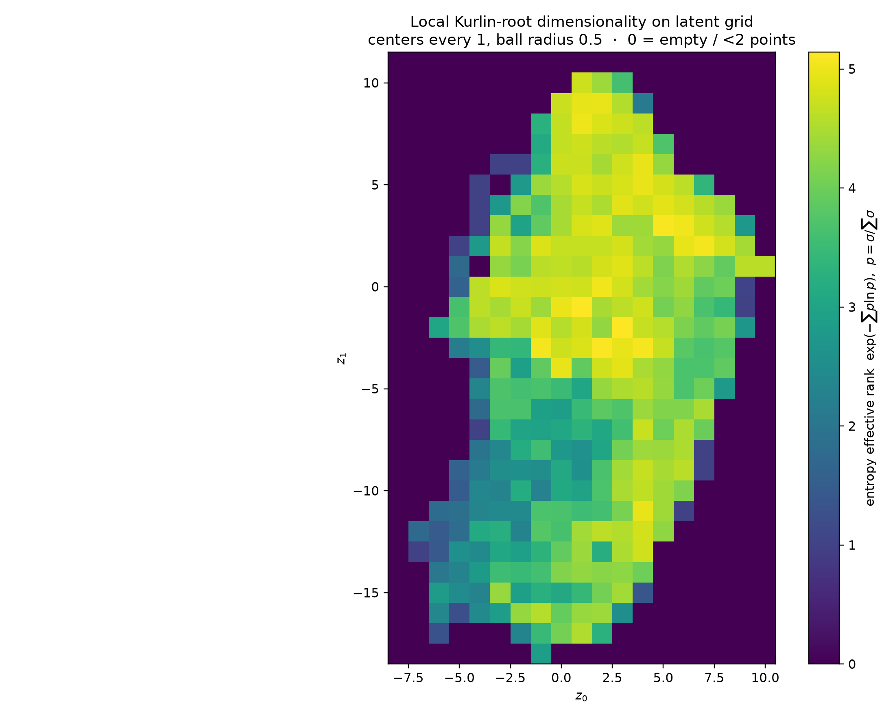

# A load of unit cells: setting-invariant search, exact reindexing, and lattice trajectories

**[Author names]**
*[Affiliations]*
*Correspondence: [email address]*

## Synopsis

A complete root invariant removes orbit enumeration from lattice-similarity search; retaining the integer map to a canonical obtuse superbase then lifts any match back to the exact reindexing coset. The construction is demonstrated on 1361 archival lysozyme cells, a 12 474-crystal serial XFEL data set, and continuous deformation trajectories.

## Abstract

A unit cell is a basis, not a lattice identifier. In the G⁶ and S⁶ formalisms, crystallographically equivalent bases occupy an orbit, so a correct distance requires alternative reduced-cell images, 24 Selling-superbase permutations, and, near reduction boundaries, transformed paths through adjacent regions — robust, but expensive at scale. We instead use the root form of an obtuse superbase as a complete, continuous lattice invariant (Kurlin, 2022): equality of root invariants tests isometry directly, and proportionality tests similarity, with no orbit search at query time. The basis information the invariant deliberately discards is recovered by retaining the integer coordinates of the canonical superbase, so that for matched cells A and B the change of basis is an exact integer matrix P = U(A) U(B)⁻¹ with PᵀG(A)P = G(B); symmetry-related solutions form a coset, not a single operator. This *quotient-then-lift* construction is realised in a dependency-free package and validated on real data at three scales. All 1361 hen egg-white lysozyme cells in the PDB — six space groups, four crystal systems — collapse onto one setting-invariant metric in which the dominant tetragonal form resolves into a continuous 1113-cell dehydration trajectory whose intrinsic (Laplacian) coordinate recovers cell shrinkage at |r| = 0.92. A 12 474-crystal serial XFEL data set (CXIDB 83, β-lactamase, P6₃) is parsed from its CrystFEL stream and its full per-pattern indexed-cell distribution — hidden entirely by the single merged deposition — is exposed; mapping crystal orientation onto the orientation-blind invariant reveals that the long 233 Å axis is measured about 3× worse when the beam looks down it, a sampling artifact separable from true lattice spread. On benchmarks the invariant indexes 3000 cells in 0.10 s and reduces a 200-frame serial reindexing problem from 17.5 ms to 44 µs per frame.

**Keywords:** unit-cell databases; root invariants; serial crystallography; reindexing; lattice trajectories; nearest-neighbour search.

## 1. Introduction

Modern diffraction workflows produce unit cells much faster than refined structures. A structural database holds hundreds of thousands of reported cells; a serial experiment indexes tens of thousands of snapshots; a thermal, pressure, or operando experiment yields a densely sampled sequence of slightly different cells. These are usually treated as three separate software problems. They share a more basic difficulty: the measured six-tuple (a, b, c, α, β, γ) describes a *basis*, whereas the object to be compared is the *lattice* it generates.

Let B be a direct-space basis and G = BᵀB its metric tensor. Every unimodular integer matrix M gives another basis of the same lattice, B′ = BM, hence another metric representation

$$
G' = Mᵀ G M .                                                      (1)
$$

A lattice comparison based on one point G must therefore be invariant over the entire GL(3, ℤ) orbit. Reduction makes this finite in practice but does not remove its quotient geometry. In G⁶, Niggli reduction selects a fundamental region whose boundary faces must be identified by reduction transformations. In S⁶, Selling reduction is simpler — the six scalar products of an obtuse superbase lie in the non-positive orthant — but a general reduced lattice still has 24 equivalent presentations from permutations of the four superbase vectors, and a correct S⁶ distance must compare these and examine boundary-transformed paths when a scalar approaches zero (Andrews & Bernstein, 1988, 2014; Andrews et al., 2019; Andrews & Bernstein, 2023). This orbit-and-boundary machinery is not an implementation accident; it is how a many-to-one basis representation becomes a metric on lattices.

A concrete example is the primitive orthorhombic cell (10, 12, 20, 90°, 90°, 90°). One Selling presentation is [0, 0, 0, −100, −144, −400], but relabelling the four superbase vectors produces 24 equally valid S⁶ vectors (Andrews et al., 2019), so a comparison between two single S⁶ vectors can miss an exact match. Near a reduction boundary the problem is sharper: an arbitrarily small perturbation can change which reduced representative is selected. In our boundary-straddling test the distance between raw reduced S⁶ representatives changed from 0.08 to 83.7 although the physical perturbation was identical on either side; the corresponding root-form distance stayed at 0.0010 on both sides. For a single comparison the additional images are manageable; repeating the orbit work for every database candidate or every serial frame is the computational problem addressed here.

The root-form construction changes the order of operations. An obtuse superbase is four vectors v₀, …, v₃ summing to zero with non-positive pairwise scalar products. Its six conorms pᵢⱼ = −vᵢ·vⱼ are non-negative; their square roots, ordered by Voronoi type, give a uniquely ordered root invariant ρ(Λ). Kurlin (2022) proved that two three-dimensional lattices are isometric iff their root invariants coincide, and similar iff the invariants are proportional. Hence

$$
ρ(ΛA) = ρ(ΛB)                                          (isometry)
$$
$$
ρ(ΛA)/∛V(A) = ρ(ΛB)/∛V(B)                           (similarity).      (2)
$$

The root invariant is a *quotient coordinate*: all equivalent bases map to one continuous point before any search. Approximate matches are ranked with a continuous root-space metric (Bright et al., 2021). Unlike G⁶/S⁶ distance calculations, no orbit or boundary-path enumeration is required per query.

The invariant cannot, by itself, report a reindexing operator: the basis labels were intentionally removed. That information is recovered by retaining the integer transformation accumulated during Selling reduction. Let U(A) and U(B) hold three independent vectors of matched canonical superbases, expressed in the original bases of A and B. For a compatible superbase labelling,

$$
P = U(A) U(B)⁻¹,        Pᵀ G(A) P = G(B).                          (3)
$$

Because U(A) and U(B) are unimodular integer matrices, P is an *exact* integer change of basis; floating-point tolerances enter only when noisy metrics are verified. A generic root form fixes the superbase correspondence directly; at degeneracies, the finite superbase permutations compatible with equal root products are tested. If the lattice has non-trivial automorphisms the answer is necessarily a coset, H(A)P = P H(B), not a unique matrix — a feature, since in serial crystallography the residual cosets relative to the crystal Laue group are exactly the indexing branches that intensities must distinguish.

This quotient-then-lift construction is the common thread of the present work, and we validate it not on synthetic cells alone but on real data at three scales: an entire single-protein census from the PDB, a complete serial XFEL indexing stream, and continuous deformation series. The continuous question — *how similar are the lattices?* — is answered before the discrete question — *which basis transformation applies?*

## 2. From a root match to an operator

For each input cell we perform Selling reduction while accumulating the unimodular integer operations applied to its basis. The reduced obtuse superbase yields both (i) the ordered root invariant used as search key and (ii) the integer coordinates needed to return to the reported basis. Reconstructing a canonical superbase from the root invariant alone gives its geometry only up to Euclidean isometry, whereas the accumulated integer coordinates preserve the provenance of the actual crystallographic setting (Kurlin, 2022, Lemma 6.2).

For an exact lattice match, compatible root forms identify the correspondence between the two canonical superbases, and equation (3) gives candidate operators without searching an unrestricted set of small unimodular matrices. Each candidate is accepted by the metric identity PᵀG(A)P = G(B); in noisy data the same calculation returns the exact integer P minimising a metric residual, never a rounded floating-point matrix. Only the 24 superbase index permutations, plus a possible overall inversion when orientation is not fixed, need be considered after a root-space match.

The complete operator set depends on context. For database identity, one representative P usually suffices. For serial data, if H is the lattice holohedry and L the crystal Laue group, the distinct classes in H/L are the indexing ambiguities, computed once for the reference lattice and reused. For a deliberately changing lattice, equation (3) is only approximate and the residual grows with deformation, so operators are assigned locally — between neighbouring states or via landmarks — and composed along the path rather than forced across the full trajectory.

## 3. Results

### 3.1. An entire protein census on one metric (1361 archival cells)

We retrieved every hen egg-white lysozyme entry in the PDB (UniProt P00698): 1372 entries, 1361 with a crystallographic cell. These span six space groups and four crystal systems — P4₃2₁2 tetragonal (1152 cells, 85%), P2₁2₁2₁ orthorhombic (100), P2₁ monoclinic (59), P1 triclinic (41), and small hexagonal/trigonal minorities. Compared as raw six-tuples these would scatter identical lattices into different points and merge unrelated ones; compared as root invariants they collapse onto a single setting-invariant metric (Fig. 2a) in which each crystal system occupies a distinct, coherent region and the full 1361 × 1361 root-distance matrix is meaningful across systems at once.

Within the dominant tetragonal form the 1113 native-volume cells (a ≈ b, all angles fixed) are not a point but a continuous body spanning a 26 % volume range. Because this subset is high-symmetry and single-setting it is fully described by (a, c); the invariant is not strictly required *here*, but it is what isolated this clean subset from the six-space-group census in the first place. The second Laplacian eigenvector of the root-distance graph — the smoothest intrinsic coordinate on the manifold — recovers the cell-shrinkage axis at |r| = 0.92 (Fig. 2c). Parameterising by this coordinate t ∈ [0, 1] gives a smooth, monotone a(t) rising 76.8 → 80.0 Å, while c(t) is near-flat with a step from ≈ 37.0 to ≈ 38.0 Å (Fig. 2b): the deformation is anisotropic and staged — the a-axis expands continuously while c shifts between two preferred hydration configurations — consistent with a dehydration series. The path is a curved arc through invariant space (arc/chord ≈ 1.18), the bend recording the staged repacking that a single endpoint comparison discards. This is the manifold picture on real archival data: a "diverse" census of 1361 independent determinations resolved into a handful of crystal forms plus one continuous, physically interpretable deformation coordinate.

### 3.2. A complete serial XFEL indexing stream (12 474 crystals)

Merged depositions report one cell per structure. The per-pattern indexed-cell distribution — where reindexing ambiguity, cell scatter and misindexing actually live — is visible only in the primary indexing output. We parsed the CrystFEL stream for a β-lactamase (BlaC) serial data set (CXIDB entry 83; 222 MB indexing stream) with a dependency-free reader added to the package: 14 445 diffraction patterns, 12 474 indexed crystals (86 % rate), space group P6₃, hexagonal (≈ 41.8 × 41.8 × 233 Å).

The 12 474 per-pattern cells form a cloud that the single merged deposition reduces to one point (Fig. 2d). The long c-axis has a sharp core (median 233.3 Å, median absolute deviation only 0.13 Å) with a heavy tail to 245 Å; in the root-invariant manifold these cells form one connected body with a smooth c-gradient (Fig. 2e), confirming a genuine one-parameter spread rather than discrete misindexing classes.

Because the root invariant is orientation-blind by construction, colouring the manifold by each crystal's orientation is a direct bias test: an unbiased data set should show orientation scattered randomly across the manifold, and it largely does. The residual weak coupling it exposes is physically real and diagnostic (Fig. 2f): crystals struck with the beam nearly parallel to c\* determine the 233 Å axis about 3× more poorly (c-scatter 1.53 Å for beam within 10° of c\*, versus ≈ 0.5 Å near the ab-plane), because reflections fixing the long axis are poorly sampled when looking down it. The manifold's tail is therefore enriched in an identifiable orientation class — a concrete signal for down-weighting those crystals in merging, and evidence that part of the apparent c-axis spread is a sampling artifact, not lattice variation. Orientation itself is uniformly distributed and handedness consistent, as expected for serial crystallography; the P6₃ merohedral ambiguity resides in the reindexing coset, which geometry surfaces and intensities resolve.

### 3.3. Benchmarks and continuous trajectories

*Database search.* Because the root invariant is a fixed six-vector in Å, exact nearest-neighbour search uses a `scipy.spatial.cKDTree` on the precomputed root components (a pure-Python metric NearTree [Andrews & Bernstein, 2016] is retained only for non-Euclidean G⁶/S⁶ distances). Over 3000 perturbed cells the index builds in 0.04 s; 40/40 exact nearest-neighbour queries recovered the planted cell at a median 0.02 ms, and queries placed on opposite sides of a reduction boundary returned the same reference lattice. On the full PDB holdings (206 214 cells) the same index builds in 0.28 s with median 0.04 ms k=10 queries. The invariant performs the high-volume filtering; equation (3) is evaluated only for returned neighbours. Volume-spanning searches first enumerate low-index Hermite-normal-form sublattices, reduce and deduplicate them by root invariant, and query each distinct lattice — surfacing rather than hiding supercell non-uniqueness (an orthorhombic 40/50/60 Å lattice has seven distinct index-two sublattices, all kept as separate candidates).

*Serial reindexing.* On 200 perturbed monoclinic frames including settings on both sides of a reduction flip, a brute-force reference tested 6960 small unimodular matrices per frame at 23 ms per frame; the root-first workflow established identity, lifted each frame through its canonical superbase, and reduced the admissible result to a cached two-operator reference coset tested at 0.07 ms per frame — a ≈ 330-fold per-frame reduction (≈ 180-fold amortised). Geometry returns the exact admissible operators; intensity correlation remains the tie-breaker when two coset representatives are metrically equivalent (Brehm & Diederichs, 2014; Gildea & Winter, 2018).

*Deformation trajectory.* A synthetic 41-cell monoclinic series shrinking c from 150 to 100 Å (a = 120, b = 189.1 Å, β = 91.2°) passes through a = c at t = 0.60, where axis exchange becomes an exact lattice symmetry. The Fiedler coordinate (Fiedler, 1973) of a four-neighbour root-distance graph recovered the imposed coordinate at |r| = 0.9913; the accumulated adjacent path length was 50.13 Å versus a 35.88 Å endpoint chord — the difference recording deformation a single comparison discards. The root graph supplies the order; the canonical-superbase lift supplies local frames attached at the two endpoints and the symmetry junction. No tolerance makes one exact integer operator map the two deliberately different endpoints; the path is part of the answer.

*Archival-scale similarity embedding.* Volume-normalised root invariants \(s = \mathrm{RI}/V^{1/3}\) place every PDB cell in a common shape space. Embedding the full holdings (206 214 cells) with a metric-neighbourhood network into a two-dimensional latent plane yields a continuous census in which crystal systems occupy coherent regions. To ask how many independent shape degrees of freedom remain *locally*, we tile the latent plane with unit centres and, in each ball of radius 0.5, compute a mean-centred SVD of the six-vector \(s\). The local dimensionality is the entropy (Roy–Vetterli) effective rank \(\exp(-\sum_i p_i\ln p_i)\) with \(p_i=\sigma_i/\sum_j\sigma_j\); empty cells and balls with fewer than two points are scored zero (Fig. 4). Of 570 grid cells, 322 are occupied; among those the effective rank has median 4.12 and spans roughly 1–5.1. High-rank patches mark fuller local variation of the similarity invariant; low-rank filaments are locally near one-parameter families — the same continuous geometry the smaller lysozyme and XFEL manifolds already illustrated, now read off the archive as a whole.

*Figure 1. The quotient-then-lift workflow. Root invariants supply a basis-independent metric index; integer coordinates retained during canonical-superbase construction lift selected neighbours back to explicit operators by P = U(A) U(B)⁻¹. (a) Two-dimensional projection of the 3000-cell nearest-neighbour index. (b) Serial benchmark: repeated 6960-matrix search versus a cached two-operator reference coset. (c) Root-distance graph for the 41-state shrinkage trajectory, with local operators attached at the endpoints and the a = c junction. Projection geometry in (a) and (c) is illustrative; numerical annotations are from the six-dimensional calculations.*

*Figure 2. Real-data validation. Top — an archival database census (hen egg-white lysozyme, 1361 PDB cells): (a) all six space groups and four crystal systems on one setting-invariant root-invariant metric; (b) within the 1113-cell native tetragonal form, a(t) and c(t) along the intrinsic deformation coordinate show anisotropic, staged dehydration; (c) Laplacian spectral embedding whose Fiedler axis recovers cell shrinkage (|r| = 0.92). Bottom — a complete serial XFEL indexing stream (β-lactamase, CXIDB 83, 12 474 indexed crystals, P6₃): (d) the per-pattern indexed-cell cloud that the merged deposition collapses to one point (★); (e) the root-invariant manifold coloured by c, one connected body with a smooth gradient; (f) orientation diagnostic — the 233 Å axis is measured worst (largest per-pattern c-scatter) when the beam looks down c\*.*

*Figure 4. Local dimensionality of the PDB similarity embedding. Unit grid on the two-dimensional latent plane of 206 214 volume-normalised root invariants; colour is the entropy effective rank of a mean-centred SVD of \(s=\mathrm{RI}/V^{1/3}\) inside a ball of radius 0.5 (zero where empty or \(n<2\)). Occupied cells span effective ranks ≈ 1–5.1 (median 4.12).*

## 4. Discussion

The useful distinction is between a quotient and a lift. G⁶ and S⁶ provide physically meaningful coordinates, but a lattice distance in either must account for equivalent presentations and glued boundaries. The root invariant performs that quotient once, giving a continuous key suitable for large-scale search; retaining the integer reduction history then lifts a selected match back to the basis-level operator that crystallographic processing needs. This prevents three category errors: treating alternative bases as different database entries, using a lattice-identity test as though it already specified the reflection reindexing, and forcing distant states of a deformation into one pairwise integer map.

The real-data cases show the construction is not merely a benchmark convenience. A whole-protein PDB census reduces to one cross-system metric on which a genuine deformation trajectory is legible; a complete serial XFEL stream exposes a per-pattern cell distribution that every merged deposition hides, and the orientation-blindness of the invariant becomes an experimental diagnostic rather than a limitation. The archival similarity embedding and its local entropy-rank map (Fig. 4) extend that picture from single-protein and single-experiment manifolds to the full PDB shape census. The remaining work is validation depth, not scope: database timing on archival-scale, multi-protein holdings is now included (206 214 PDB cells, §3.3); serial validation against experimental intensities and production reindexing decisions; and trajectory transport on measured thermal, time-resolved or operando series with uncertainty propagation and cycle-consistency diagnostics. The central algorithmic claim is narrow and, we believe, now well supported: similarity need not be solved by an orbit search, and recovering the operator need not reopen the unrestricted search the invariant eliminated.

## Data and code availability

The implementation (a dependency-free Python package with a zero-dependency runtime and oracle-validated test suite), the CrystFEL stream parser, benchmark inputs, and the scripts generating Figs 1 and 2 will be deposited in a versioned public repository before submission. The lysozyme cells derive from public PDB entries (UniProt P00698). The serial data are a β-lactamase XFEL data set deposited as CXIDB entry 83. [Authors to confirm the CXIDB accession and add its primary citation.] [Insert repository URL and archival DOI.]

## Acknowledgements and AI-tool disclosure

[Insert funding and acknowledgements.] [Confirm before submission:] Generative AI tools were used for exploratory coding and language editing. All algorithms, numerical results, references and scientific claims were independently checked and approved by the authors.

## References

Andrews, L. C. & Bernstein, H. J. (1988). *Acta Cryst.* A44, 1009–1018. https://doi.org/10.1107/S0108767388006427

Andrews, L. C. & Bernstein, H. J. (2014). *J. Appl. Cryst.* 47, 346–359. https://doi.org/10.1107/S1600576713031002

Andrews, L. C. & Bernstein, H. J. (2016). *J. Appl. Cryst.* 49, 756–761. https://doi.org/10.1107/S1600576716004039

Andrews, L. C., Bernstein, H. J. & Sauter, N. K. (2019). *Acta Cryst.* A75, 593–599. https://doi.org/10.1107/S2053273319002729

Andrews, L. C. & Bernstein, H. J. (2023). *Acta Cryst.* A79, 485–498. https://doi.org/10.1107/S2053273323004692

Brehm, W. & Diederichs, K. (2014). *Acta Cryst.* D70, 101–109. https://doi.org/10.1107/S1399004713025431

Bright, M., Cooper, A. I. & Kurlin, V. (2021). A complete and continuous map of the Lattice Isometry Space for all 3-dimensional lattices. arXiv:2109.11538.

Fiedler, M. (1973). *Czechoslovak Math. J.* 23, 298–305. https://doi.org/10.21136/CMJ.1973.101168

Gildea, R. J. & Winter, G. (2018). *Acta Cryst.* D74, 405–410. https://doi.org/10.1107/S2059798318002978

Kurlin, V. (2022). A complete isometry classification of 3-dimensional lattices. arXiv:2201.10543.
